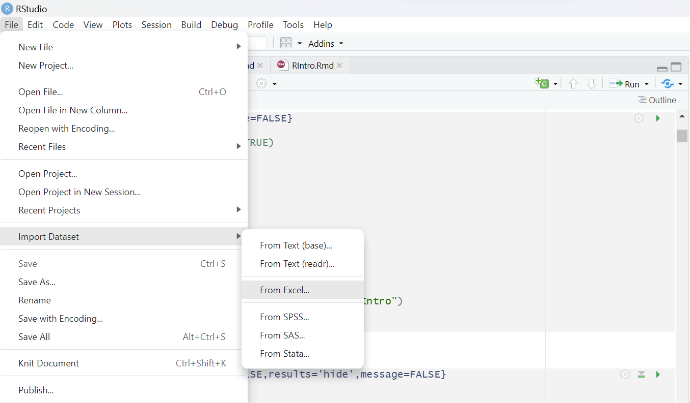

# My beamer

> BlaBlaBla

<!-- ## Setup -->


```{r setup, echo=FALSE, include=FALSE}
library(knitr) #to produce dynamic reports, allowing the embedding of R code, its results, and text into a single document
# knitr::opts_chunk$set(echo = TRUE)
library(haven) #to import and export data in SPSS, Stata, and SAS formats, enhancing interoperability with other statistical software
library(rmarkdown) #is used to convert files that contain text and R code into documents of various formats, such as HTML, PDF, and Word
library(writexl) #to export tabular data from R to Excel files
library(Hmisc) #provides a collection of functions for data manipulation, statistical analysis, and graph creation, facilitating various stages of the analytical process
library(naniar) #exploring and visualizing missing data in the dataset
library(here)
library(rstatix)
library(DescTools)
rm(list = ls())
here()
getwd()

#knitr::opts_knit$set(root.dir = "C:\\Users\\Joana Cima\\Documents\\GitHub\\RIntro")

# Define working directory

here()
#setwd("C:\\Users\\Joana Cima\\Documents\\GitHub\\RIntro")

```

<!-- ## Load your libraries -->

```{r Libraries & Data, echo=FALSE,results='hide',message=FALSE , include=FALSE}
library(tidyverse) #provides a set of tools for data manipulation, visualization, and modeling
library(readxl) # allows us to read Excel files (.xls or .xlsx) directly into R. 
library(visdat) #to explore our dataset through visualizations.
library(stargazer) #to produce beautiful LaTeX or HTML tables and descriptive statistics from R statistical output
library(GGally) #to extend ggplot2 functionality to create a scatterplot matrix

```
# Outline

1. Motivation
2. Data
3. Conceptual discussion


# 3. Import data (from an excel file)

## Load your data using point and click

{width=31%}

which corresponds to the following code

```{r }
nlswork <- as.data.frame(read_excel("nlswork.xlsx"))
# nlswork <- read_dta("nlswork.dta") # in case you have a Stata data source

head(nlswork)

colnames(nlswork)

str(nlswork)

```


# 4. Data manipulation -- check the pipe operator, %>%


## 4.1. Select a subset of variables

```{r }
nlswork_s<- nlswork %>% 
  select(idcode, ln_wage) 

```

## 4.2. Rename variables

```{r }
nlswork_r <- nlswork %>% 
  rename(cae = ind_code)

```

## 4.3. Filter a subset of observations

```{r }
nlswork_f<- nlswork %>% 
  filter(age > 20) 

```

## 4.4. Mutate: create variables

```{r }
 nlswork_m <- nlswork %>% 
  mutate(ln_asd=log(age))

```

## 4.5. Manipulate the data in a single sequence

```{r}
nlswork_new <- nlswork %>% 
  rename(cae = ind_code) %>%
  select(ln_wage, age, year, race, union, collgrad, cae, ttl_exp, hours ) %>% 
  filter(age>=20) %>%
  mutate(age2=age^2)

```

# 5. Detecting and Handling Missing Data

## 5.1 Detect Missing Data

<!-- # https://cran.r-project.org/web/packages/naniar/vignettes/naniar-visualisation.htmlhttps://cran.r-project.org/web/packages/naniar/vignettes/naniar-visualisation.html -->

```{r }

vis_miss(nlswork_new)

```

```{r }
gg_miss_var(nlswork_new) + labs(y = "Total missing values for each variable")
gg_miss_upset(nlswork_new)

```

```{r}

gg_miss_fct(x = nlswork_new,fct = year)

```


### Alternative

```{r }
vis_dat(nlswork_new)

```

## 5.2.  Handling Missing Data

Handling missing data is a crucial step in the exploratory data analysis. Depending on the nature and mechanism of the missingness, we might decide to impute missing values or to exclude the observations with missing data.

### 5.2.1 Filling Missing Data 

In some situations, we may opt to fill in the missing data. For instance, one common method involves replacing missing values with the mean of the variable.

```{r }

library(tidyverse)
# Filling Missing Data 

## (with the average - this is an example - it does not make sense in this case)
nlswork_filled <- nlswork %>% 
  mutate(across(c("union"), ~ ifelse(is.na(.), mean(., na.rm = TRUE), .))) 

## (with the mode)
    ### Create a function to compute mode

mode <- function(x) {
  ux <- unique(x)
  ux[which.max(tabulate(match(x, ux)))]
}

nlswork_filled2 <- nlswork

union_mode <- mode(nlswork$union[!is.na(nlswork$union)])
nlswork_filled2$union[is.na(nlswork$union)] <- union_mode


```

### 5.2.2 Excluding rows with missing data
```{r }

nlswork_no_na <- na.omit(nlswork_new)

```

# 6 Detecting and Handling Outliers 

## 6.1 Detecting Outliers 
### 6.1.1. Using Boxplot (example: age and ln_wage)

```{r }
boxplot(nlswork_no_na$age, main="Boxplot for Outlier Detection - Age")
```

```{r }
boxplot(nlswork_no_na$ln_wage, main="Boxplot for Outlier Detection - ln_wage")
```
### 6.1.2. Detecting Outliers using "identify_outliers" (example: ln_wage)

```{r }
outliers <- identify_outliers(as.data.frame(nlswork_no_na$ln_wage))
extreme_outliers <- outliers[outliers$is.extreme, ]
extreme_outliers
```
## 6.2 Handling Outliers 
### 6.2.1 Removing the outliers from the original dataframe nlswork_no_na

```{r }
extreme_values_to_remove <- extreme_outliers$`nlswork_no_na$ln_wage`
nlswork_no_outliers <- nlswork_no_na[!nlswork_no_na$ln_wage %in% extreme_values_to_remove, ]
```

### 6.2.2 Replacing the outliers using winsorize

```{r }
nlswork_no_na$ln_wage_winsorized <- Winsorize(nlswork_no_na$ln_wage, 
									probs = c(0, 0.99))
```


# 7. Descriptive statistics

```{r }
summary(nlswork_no_na) 

```

## 7.1. Export descriptive statistics table to html, with 2 digits

```{r, echo = FALSE, results='asis'}
nlswork_no_na  %>%
  dplyr::select(age, collgrad, ttl_exp, union, hours, ln_wage_winsorized) %>% 
  stargazer(title="Shorter statistics",
            type= "text", out = "Statistics_output.html",
            digits = 2)

```

## 7.2. Export descriptive statistics table to txt, with 3 digits

```{r, echo = FALSE, results='asis'}
nlswork_no_na %>%
  dplyr::select(age, collgrad, ttl_exp, union, hours, ln_wage_winsorized) %>% 
  stargazer(title="Shorter statistics",
            type= "text", out = "Statistics_output.txt",
            digits = 3)

```

## 7.3. Transposing the descriptive statistics table

```{r, echo = FALSE, results='asis'}
nlswork_no_na %>%
  dplyr::select(age, collgrad, ttl_exp, union, hours, ln_wage_winsorized) %>% 
  stargazer(title="Shorter statistics",
            type= "text", out = "Statistics_output2.html",
            digits = 3, flip=TRUE)

```

## 7.4. Export to pdf 

```{r, echo = FALSE, results='asis', warning=FALSE}
nlswork_no_na %>%
  dplyr::select(age, collgrad, ttl_exp, union, hours) %>% 
  stargazer(title="Shorter statistics",
            type= "latex",
            digits = 3, flip=TRUE)

```


# 8. Visualisation to explore your data

## 8.1. Relationship Between Continuous Variables

```{r echo=FALSE, warning=FALSE, results='asis'}
nlswork_no_na %>% 
      ggplot(aes(ttl_exp,ln_wage_winsorized)) +
      labs(title = "Ln Wage vs. Experience") +
      ylab("Ln Wage") +
      xlab("Experience") +
      geom_point() +
  geom_smooth(method = "lm", se = FALSE, color = "blue")


```

## 8.2. Categorical variable
```{r}
ggplot(data = nlswork_no_na) +
  geom_bar(mapping=aes(x=as.factor(collgrad))) +
  xlab("College graduate (1=Yes)")

```

  
## 8.3. Continuous Variable Distributions

```{r }
ggplot(data = nlswork_no_na) + geom_histogram(mapping = aes(x = age), binwidth = 1) + 
  scale_x_continuous(breaks = seq(20, 50, by = 5))

```

## 8.4 Categorical and continuous variables

```{r}
nlswork_no_na %>% ggplot(aes(x=as.factor(collgrad), y=ln_wage_winsorized)) +
  geom_boxplot(fill="slateblue", alpha=0.2) + 
  xlab("College graduate (1=Yes)")
```

```{r,warning=FALSE}
nlswork_no_na %>% ggplot(mapping = aes(x = ln_wage, y = ..density..)) +
    xlab("ln(wage)") +
    ylab("Density") +
    geom_freqpoly(mapping = aes(colour = factor(collgrad, labels=c("No", "Yes")))) +
  labs(color ="College degree")
```

# 9. Correlation
```{r,warning=FALSE}
ggpairs(nlswork_no_na[, c("age","ttl_exp","hours")], title="Correlogram with ggpairs()")
```


```{r include=FALSE}
#CONVERSÃO DO CÓDIGO RMARKDOWN PARA O CÓDIGO R

#options(knitr.duplicate.label = "allow")

#knitr::purl(input= "RIntro.Rmd", output = "RIntro.R")

```


# 10. Assessment

<!-- Please put the R solution between 'begin solution' and 'end solution', but analyze the results outside the chunks -->

## Problem 1: Data Importing
Import the "card" dataset.

```{r,warning=FALSE}
#BEGIN SOLUTION
card <- as.data.frame(read_excel("card.xlsx"))

#END SOLUTION
```

## Problem 2: Visualizing Missing Data
Graphically show which variables have the most missing values. Please elaborate.

```{r,warning=FALSE}
#BEGIN SOLUTION

#END SOLUTION
```

## Problem 3: Handling Missing Data
Adopt a strategy to handle the missing values. Why did you follow that strategy?
How many observations were lost?

```{r,warning=FALSE}
#BEGIN SOLUTION

#END SOLUTION
```

## Problem 4: Detecting outliers
Analyze if the variable lwage has outliers. If so, how will you deal with them? Explain step by step.

```{r,warning=FALSE}
#BEGIN SOLUTION


#END SOLUTION
```


## Problem 5: Descriptive Statistics after Missing Data and Outliers Handling
Present statistics of the dataset that has been treated for missing values and outliers.

```{r,warning=FALSE}
#BEGIN SOLUTION

#END SOLUTION
```

## Problem 6: Relationship Visualization
Graphically show the relationship between age and salary.Does the relationship between the variables make sense?

```{r,warning=FALSE}
#BEGIN SOLUTION

#END SOLUTION
```

## Problem 7: Age Distribution
Display the distribution of Age

```{r,warning=FALSE}
#BEGIN SOLUTION

#END SOLUTION
```

## Problem 8: Correlation
What is the correlation value between age and salary?

```{r,warning=FALSE}
#BEGIN SOLUTION

#END SOLUTION
```


## Problem 9:
In the nlswork_no_na dataset, can you identify any patterns or trends in the data related to unionized workers and their salaries?

```{r,warning=FALSE}
#BEGIN SOLUTION

#END SOLUTION
```


